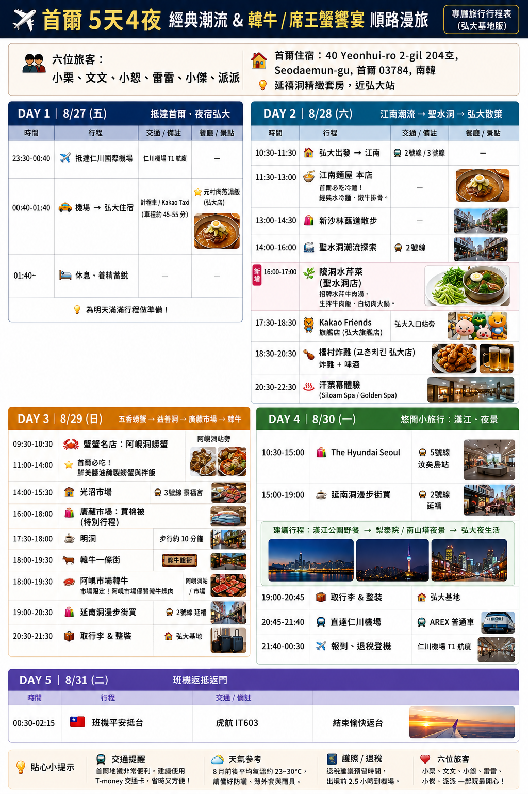

# 🇰🇷 2026 首爾旅遊手札

- **日期：** 2026/08/27（四）－2026/08/31（一），8/31 抵達台灣
- **交通：** 台灣虎航，桃園 TPE 往返仁川 ICN
- **主題：** 初次韓國、首爾散策與美食

## ✈️ 航班與跨日

| 方向 | 航班 | 預定出發（當地時間） | 預定抵達（當地時間） |
| :--- | :--- | :--- | :--- |
| 桃園 → 仁川 | IT602 | 8/27 20:00（台灣） | 8/27 23:30（韓國） |
| 仁川 → 桃園 | IT603 | 8/31 00:30（韓國） | 8/31 02:15（台灣） |

航班時間取自[同行者行程網頁](https://wenwen1109.github.io/travel/seoul_260827.html)，屬預定時間；Google Maps 在仁川的首筆停留是 **8/28 00:00**，返台後首筆機場停留是 **8/31 02:11**，定位時間不等於實際起降時間。

## 🗓️ 實際走訪時間軸

依個人 Google Maps Timeline 整理。韓國段使用原檔的 **UTC+9**，台灣段使用 **UTC+8**，時間顯示至分鐘。區域名稱由座標推估，未確認的店家不直接套用預估行程；可點地圖核對原定位。重疊的相鄰定位合併顯示，跨午夜的停留註明隔日。

### Day 1：8/27（四）桃園出發

| 時間（台灣） | 紀錄 |
| :--- | :--- |
| 18:12–20:30 | 桃園機場周邊多筆停留，含重疊定位與短暫移動 |
| 晚間 | 搭乘 IT602 前往仁川；韓國入境後紀錄接續於 8/28 |

### Day 2：8/28（五）抵達仁川、弘大、明洞、聖水與東廟

| 時間（韓國） | 停留區域（座標推估） | 原定位 |
| :--- | :--- | :--- |
| 00:00–00:13 | 仁川機場周邊 | [地圖](https://www.google.com/maps/search/?api=1&query=37.456115,126.445082&query_place_id=ChIJbQ67I9SbezURzUR3jDWZRkc) |
| 00:20–01:16 | 仁川機場周邊 | [地圖](https://www.google.com/maps/search/?api=1&query=37.449076,126.451809&query_place_id=ChIJgT_fWmKaezURuy7Mt5iDv7s) |
| 01:55–02:13 | 弘大／延南洞周邊 | [地圖](https://www.google.com/maps/search/?api=1&query=37.560862,126.927440&query_place_id=ChIJlXHY4-uYfDUROC4Ui9Si4No) |
| 02:20–03:17 | 弘大周邊 | [地圖](https://www.google.com/maps/search/?api=1&query=37.556197,126.925034&query_place_id=ChIJ68AiKsWYfDUROpTctLKtxtU) |
| 03:31–10:48 | 弘大／延南洞周邊（夜間長停留） | [地圖](https://www.google.com/maps/search/?api=1&query=37.559755,126.927813&query_place_id=ChIJJTiQRIiZfDUR0NlqW1jtigI) |
| 10:54–11:33 | 弘大周邊 | [地圖](https://www.google.com/maps/search/?api=1&query=37.556442,126.923808&query_place_id=ChIJx-2j5MKYfDURYWWYZAXSDRQ) |
| 11:38–13:04 | 延南洞周邊 | [地圖](https://www.google.com/maps/search/?api=1&query=37.559538,126.921544&query_place_id=ChIJEdot_OeYfDURbTNZndyFd3M) |
| 13:51–15:30 | 明洞周邊 | [地圖](https://www.google.com/maps/search/?api=1&query=37.560751,126.986677&query_place_id=ChIJB3adfvqifDURG5y_RMiTup8) |
| 16:55–18:02 | 聖水洞周邊 | [地圖](https://www.google.com/maps/search/?api=1&query=37.542824,127.054373&query_place_id=ChIJtftAMZGkfDUR-dM7GT6Vl3g) |
| 18:19–19:44 | 聖水洞周邊 | [地圖](https://www.google.com/maps/search/?api=1&query=37.541685,127.061253&query_place_id=ChIJf5seGgClfDURTfd1UENPyV8) |
| 19:56–20:09 | 往十里周邊 | [地圖](https://www.google.com/maps/search/?api=1&query=37.558721,127.038103&query_place_id=ChIJw_eS0VijfDUR0-fWHntNi1A) |
| 20:25–23:20 | 東廟周邊 | [地圖](https://www.google.com/maps/search/?api=1&query=37.571729,127.015299&query_place_id=ChIJtS4fezejfDURAQxizqvG8MA) / [另一定位](https://www.google.com/maps/search/?api=1&query=37.571758,127.015208&query_place_id=ChIJIcLHZDejfDURP27t4syQLN0) |
| 23:59–8/29 00:02 | 合井周邊 | [地圖](https://www.google.com/maps/search/?api=1&query=37.549575,126.913991&query_place_id=ChIJV1A_Y9aYfDUR2PkPvMQNZ_g) |

### Day 3：8/29（六）光化門、鷺梁津、廣藏市場與馬場洞

| 時間（韓國） | 停留區域（座標推估） | 原定位 |
| :--- | :--- | :--- |
| 00:04–01:30 | 弘大周邊 | [地圖](https://www.google.com/maps/search/?api=1&query=37.553594,126.920135&query_place_id=ChIJOc4lEduYfDURupLmvgHXcMs) |
| 01:57–11:22 | 弘大／延南洞周邊（夜間長停留） | [地圖](https://www.google.com/maps/search/?api=1&query=37.560084,126.928007&query_place_id=ChIJgRiRxOuYfDURYy_AtYWrnd4) |
| 11:33–12:28 | 弘大周邊 | [地圖](https://www.google.com/maps/search/?api=1&query=37.553816,126.920205&query_place_id=ChIJ32YLFNuYfDURTwcE8Md3jHY) |
| 12:57–14:36 | 光化門周邊 | [地圖](https://www.google.com/maps/search/?api=1&query=37.572389,126.976912&query_place_id=ChIJrUQcQuuifDUR-IWAEQylVek) |
| 14:47–15:02 | 首爾市廳周邊 | [地圖](https://www.google.com/maps/search/?api=1&query=37.566585,126.978204&query_place_id=ChIJKwjLMvOifDURqPAMQqxwK-k) / [另一定位](https://www.google.com/maps/search/?api=1&query=37.566257,126.977815&query_place_id=ChIJE-l5hPKifDUR01NCnJJCs6E) |
| 15:23–17:37 | 鷺梁津水產市場周邊 | [地圖](https://www.google.com/maps/search/?api=1&query=37.514972,126.938634&query_place_id=ChIJOTEaKmiffDURNTst1Jzcm_c) |
| 17:37–17:45 | 鷺梁津站周邊 | [地圖](https://www.google.com/maps/search/?api=1&query=37.514082,126.941687&query_place_id=ChIJFVIwBGiffDUR25EZohv31V0) |
| 18:06–19:27 | 廣藏市場周邊 | [地圖](https://www.google.com/maps/search/?api=1&query=37.570390,127.000945&query_place_id=ChIJ1TPNEiGjfDUR8IrAp9A8CPw) |
| 19:46–19:52 | 新設洞周邊 | [地圖](https://www.google.com/maps/search/?api=1&query=37.577586,127.029998&query_place_id=ChIJya8Zna28fDURvigCNtH4m7c) |
| 19:59–21:22 | 馬場洞周邊 | [地圖](https://www.google.com/maps/search/?api=1&query=37.570106,127.037817&query_place_id=ChIJpealoFWjfDUR2ACgzkn79ow) |
| 22:00–22:48 | 明洞周邊 | [地圖](https://www.google.com/maps/search/?api=1&query=37.563770,126.984476&query_place_id=ChIJXz2vx_GifDURImd3aTJZ1VA) |
| 22:49–23:42 | 明洞周邊 | [地圖](https://www.google.com/maps/search/?api=1&query=37.561669,126.985844&query_place_id=ChIJqb-ne_CifDURR-yH8a3sjXM) |

### Day 4：8/30（日）獎忠洞、廣津橋、蠶室與返程機場

| 時間（韓國） | 停留區域（座標推估） | 原定位 |
| :--- | :--- | :--- |
| 00:17–11:10 | 弘大／延南洞周邊（夜間長停留） | [地圖](https://www.google.com/maps/search/?api=1&query=37.560084,126.928007&query_place_id=ChIJgRiRxOuYfDURYy_AtYWrnd4) |
| 11:35–13:10 | 延南洞周邊 | [地圖](https://www.google.com/maps/search/?api=1&query=37.559650,126.923646&query_place_id=ChIJs2FZp2eZfDURzeN82-kMP64) |
| 13:47–14:56 | 獎忠洞周邊 | [地圖](https://www.google.com/maps/search/?api=1&query=37.557351,127.007550&query_place_id=ChIJo5XpJeyjfDURSNGiHZfVOF8) |
| 16:00–16:50 | 廣津橋周邊 | [地圖](https://www.google.com/maps/search/?api=1&query=37.544762,127.113096&query_place_id=ChIJC_5mLU2lfDURNW_55-MTtVg) / [另一定位](https://www.google.com/maps/search/?api=1&query=37.544429,127.114218&query_place_id=ChIJF74FKFelfDUR5uCRDJ2W3p4) |
| 17:01–20:49 | 蠶室／樂天世界購物中心周邊 | [地圖](https://www.google.com/maps/search/?api=1&query=37.513679,127.104209&query_place_id=ChIJESJ9VqalfDUR9NRANup1KT8) / [另一定位](https://www.google.com/maps/search/?api=1&query=37.513487,127.104865&query_place_id=ChIJY4ot2QqlfDURFzi2WmB3i6U) |
| 21:41–21:56 | 弘大入口站周邊 | [地圖](https://www.google.com/maps/search/?api=1&query=37.557421,126.927662&query_place_id=ChIJRVcWBOqYfDURAmgqPhDK2Yc) |
| 22:53–23:00 | 仁川機場周邊 | [地圖](https://www.google.com/maps/search/?api=1&query=37.447513,126.452401&query_place_id=ChIJA-F312OaezURGNV_89NW7Ys) |
| 23:41–8/31 00:15 | 仁川機場周邊 | [地圖](https://www.google.com/maps/search/?api=1&query=37.456115,126.445082&query_place_id=ChIJbQ67I9SbezURzUR3jDWZRkc) |

### Day 5：8/31（一）凌晨抵達台灣

| 時間 | 紀錄 | 時區 |
| :--- | :--- | :--- |
| 00:00–00:15 | 延續前一晚的仁川機場周邊停留 | 韓國 UTC+9 |
| 凌晨 | 搭乘 IT603 返回台灣 | 航班預定時間見上表 |
| 02:11–02:37 | 桃園機場周邊停留，已合併重疊定位 | 台灣 UTC+8 |

## 📝 原預估行程

以下依出發前提供的行程圖片整理，保留原先五天的安排，供回顧計畫與實際走訪的差異。圖片上的星期與 2026 年不一致，以下星期以實際日期為準。此區內容皆為預估，不能視為實際到訪紀錄。

點擊圖片可開啟原圖放大查看。

| 日期 | 圖片中的預估安排 |
| :--- | :--- |
| 8/27 | 抵達仁川 → 前往弘大住宿 → 元村肉煎湯飯 → 休息（部分跨至隔日凌晨） |
| 8/28 | 江南麵屋 → 新沙林蔭道 → 聖水洞 → 陵洞水芹菜 → Kakao Friends → 橋村炸雞 → 汗蒸幕 |
| 8/29 | 阿峴洞醬蟹 → 光沼市場（圖片原文）→ 廣藏市場買棉被 → 明洞 → 韓牛一條街／阿峴市場韓牛 → 延南洞 → 整理行李 |
| 8/30 | The Hyundai Seoul → 延南洞；建議漢江野餐、梨泰院／南山塔夜景 → 取行李 → AREX → 仁川機場 |
| 8/31 | 凌晨搭 IT603 返回台灣 |

圖片內部分時段重疊，上表保留候選安排，不將其拼接為已完成的路線。

### 同行者行程網頁

[開啟首爾 5 天 4 夜行程手冊](https://wenwen1109.github.io/travel/seoul_260827.html)

網頁與圖片的安排不同，例如網頁加入風川鰻魚、鷺梁津水產市場與廣津橋；保留連結方便對照不同版本。

---

[返回旅遊手札總覽](./index.html) · [返回首頁](/index.html)
