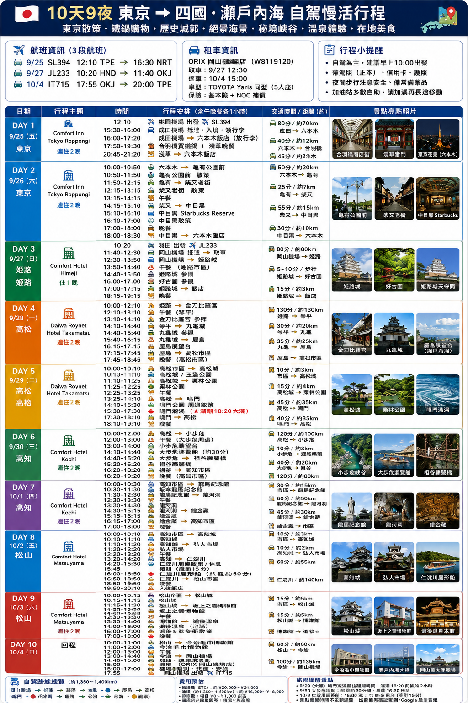

# 🗼 2026 東京・四國・瀨戶內海行程手札

::: info 尚未出發｜行程計畫
這趟旅行預計於 2026/09/25 出發，目前先依行程表記錄計畫，尚非實際遊記。以下航班、住宿、交通時間與景點安排皆為預定資訊，出發前及旅途中再依實際情況調整。
:::

<a :href="itineraryImage" target="_blank" rel="noopener">🔍 查看完整行程原圖</a>

- **日期：** 2026/09/25 (五) - 2026/10/04 (日)，10 天 9 夜
- **路線：** 東京 → 岡山 → 姬路 → 高松 → 高知 → 松山 → 今治 → 岡山
- **交通：** 桃園飛東京成田、羽田飛岡山，岡山取還車後飛回桃園
- **主題：** 東京散策、鐵鍋購物、歷史城郭、瀨戶內海、秘境峽谷、溫泉與在地美食

---

## ✈️ 預定航班

以下皆為各機場當地時間。

| 日期 | 航班 | 出發 | 抵達 |
| :--- | :--- | :--- | :--- |
| 9/25 (五) | SL394 | 12:10 桃園 TPE | 16:30 成田 NRT |
| 9/27 (日) | JL233 | 10:20 羽田 HND | 11:40 岡山 OKJ |
| 10/4 (日) | IT715 | 17:55 岡山 OKJ | 20:00 桃園 TPE |

## 🚗 租車計畫

| 項目 | 預定內容 |
| :--- | :--- |
| 租車公司 / 門市 | ORIX 岡山機場店 |
| 取車 | 9/27 12:30 |
| 還車 | 10/4 15:00 |
| 車型 | TOYOTA Yaris 同型，5 人座 |
| 保險 | 基本險 + NOC 補償 |
| 預估自駕總里程 | 約 1,350–1,400 km（依原計畫估算） |

## 🏨 住宿計畫

| 入住日期 | 地點 | 飯店 | 晚數 |
| :--- | :--- | :--- | :--- |
| 9/25 - 9/27 | 東京 | Comfort Inn Tokyo Roppongi | 2 晚 |
| 9/27 - 9/28 | 姬路 | Comfort Hotel Himeji | 1 晚 |
| 9/28 - 9/30 | 高松 | Daiwa Roynet Hotel Takamatsu | 2 晚 |
| 9/30 - 10/2 | 高知 | Comfort Hotel Kochi | 2 晚 |
| 10/2 - 10/4 | 松山 | Comfort Hotel Matsuyama | 2 晚 |

---

## 🗓️ 每日行程計畫

### Day 1：9/25 (五) 抵達東京・合羽橋購物・淺草

| 預定時間 | 行程 | 備註 |
| :--- | :--- | :--- |
| 12:10 - 16:30 | 桃園 → 成田 | SL394 |
| 抵達後 | 入境、領行李，前往六本木飯店放行李 | 原表入境時段與航班抵達時間不一致，市區安排需順延 |
| 傍晚 | 合羽橋買鐵鍋、淺草晚餐 | 依抵達時間與店家營業時間調整 |
| 20:45 - 21:20 | 淺草 → 六本木飯店 | 預定返回時間 |

**住宿：** Comfort Inn Tokyo Roppongi（第 1 晚）

### Day 2：9/26 (六) 龜有・柴又・中目黑散策

| 預定時間 | 行程 | 備註 |
| :--- | :--- | :--- |
| 10:00 - 10:50 | 六本木 → 龜有公園前 | 東京市區交通 |
| 10:50 - 11:50 | 龜有公園前散策 | 街區漫步 |
| 11:50 - 12:15 | 龜有 → 柴又老街 | 移動 |
| 12:15 - 13:15 | 柴又老街散策 | 老街巡禮 |
| 13:15 - 14:15 | 午餐 | 柴又周邊 |
| 14:15 - 15:10 | 柴又 → 中目黑 | 移動 |
| 15:10 - 16:10 | 中目黑 Starbucks Reserve | 咖啡休息 |
| 16:10 - 17:00 | 中目黑散策 | 街區漫步 |
| 17:00 - 18:00 | 晚餐 | 中目黑周邊 |
| 18:00 - 18:30 | 中目黑 → 六本木飯店 | 返回休息 |

**住宿：** Comfort Inn Tokyo Roppongi（第 2 晚）

### Day 3：9/27 (日) 飛往岡山・姬路城・好古園

| 預定時間 | 行程 | 備註 |
| :--- | :--- | :--- |
| 10:20 - 11:40 | 羽田 → 岡山 | JL233；早上需另留前往羽田與報到時間 |
| 11:40 - 12:30 | 岡山機場抵達、取車 | ORIX 岡山機場店 |
| 12:30 - 13:50 | 岡山機場 → 姬路 | 約 80 km / 80 分鐘 |
| 13:50 - 14:40 | 午餐 | 姬路市區 |
| 14:40 - 15:50 | 姬路城參觀 | 城郭巡禮 |
| 16:00 - 17:00 | 好古園參觀 | 姬路城旁庭園 |
| 17:00 - 17:15 | 前往飯店 | 入住休息 |
| 18:15 - 19:15 | 晚餐 | 姬路市區 |

**住宿：** Comfort Hotel Himeji（1 晚）

### Day 4：9/28 (一) 金刀比羅宮・丸龜城・屋島

| 預定時間 | 行程 | 備註 |
| :--- | :--- | :--- |
| 10:00 - 12:10 | 姬路 → 金刀比羅宮 | 約 130 km / 130 分鐘 |
| 12:10 - 13:10 | 午餐 | 琴平 |
| 13:10 - 14:10 | 金刀比羅宮參拜 | 依步行體力調整 |
| 14:10 - 14:40 | 琴平 → 丸龜城 | 約 20 km |
| 14:40 - 15:40 | 丸龜城參觀 | 城郭巡禮 |
| 15:40 - 16:15 | 丸龜城 → 屋島 | 約 25 km |
| 16:15 - 17:15 | 屋島展望台 | 瀨戶內海景色 |
| 17:15 - 17:45 | 屋島 → 高松市區 | 前往飯店 |
| 17:45 - 18:45 | 晚餐 | 高松市區 |

**住宿：** Daiwa Roynet Hotel Takamatsu（第 1 晚）

### Day 5：9/29 (二) 高松城・栗林公園・鳴門漩渦

| 預定時間 | 行程 | 備註 |
| :--- | :--- | :--- |
| 10:00 - 10:10 | 高松市區 → 高松城 | 約 3 km |
| 10:10 - 11:10 | 高松城 / 玉藻公園 | 參觀 |
| 11:10 - 11:25 | 高松城 → 栗林公園 | 約 4 km |
| 11:25 - 12:25 | 栗林公園 | 庭園散策 |
| 12:25 - 13:25 | 午餐 | 高松 |
| 13:25 - 14:10 | 高松 → 鳴門 | 原表估計約 35 km / 45 分鐘，出發前再確認路線 |
| 14:10 - 15:30 | 鳴門公園周邊散策 | 海景巡禮 |
| 15:30 - 17:30 | 鳴門漩渦 | 原表註記「滿潮 18:20 大潮」，潮汐與觀潮時段尚待確認 |
| 17:30 - 18:10 | 鳴門 → 高松 | 預留返程交通時間 |
| 18:10 - 19:10 | 晚餐 | 高松 |

**住宿：** Daiwa Roynet Hotel Takamatsu（第 2 晚）

### Day 6：9/30 (三) 小步危・大步危・祖谷藤蔓橋

| 預定時間 | 行程 | 備註 |
| :--- | :--- | :--- |
| 10:00 - 12:00 | 高松 → 小步危 | 約 100 km / 120 分鐘 |
| 12:00 - 13:00 | 午餐 | 大步危周邊 |
| 13:00 - 14:00 | 小步危展望台 | 峽谷景色 |
| 14:10 - 14:40 | 大步危遊覽船 | 預計約 30 分鐘 |
| 14:40 - 15:20 | 大步危 → 祖谷藤蔓橋 | 約 20 km |
| 15:20 - 16:20 | 祖谷藤蔓橋 | 散策 |
| 16:20 - 18:20 | 祖谷 → 高知市區 | 約 80 km / 120 分鐘 |
| 18:20 - 19:20 | 晚餐 | 高知市區 |

**住宿：** Comfort Hotel Kochi（第 1 晚）

### Day 7：10/1 (四) 龍馬紀念館・龍河洞・鍾乳洞探訪

| 預定時間 | 行程 | 備註 |
| :--- | :--- | :--- |
| 10:00 - 10:30 | 高知市區 → 龍馬紀念館 | 約 15 km |
| 10:30 - 11:30 | 坂本龍馬紀念館 | 參觀 |
| 11:30 - 12:30 | 龍馬紀念館 → 龍河洞 | 原表預估約 50 km / 60 分鐘 |
| 12:30 - 13:30 | 午餐 | 龍河洞周邊 |
| 13:30 - 14:30 | 龍河洞 | 參觀 |
| 14:30 - 15:15 | 龍河洞 → 鍾金藏 | 景點名稱依原表，確切地點待確認 |
| 15:15 - 16:15 | 鍾金藏 | 預定參觀，待確認景點資訊 |
| 16:15 - 17:00 | 返回高知市區 | 移動 |
| 17:00 - 18:00 | 晚餐 | 高知市區 |

**住宿：** Comfort Hotel Kochi（第 2 晚）

### Day 8：10/2 (五) 高知城・弘人市場・仁淀川

| 預定時間 | 行程 | 備註 |
| :--- | :--- | :--- |
| 10:00 - 10:10 | 高知市區 → 高知城 | 約 3 km |
| 10:10 - 11:10 | 高知城 | 參觀 |
| 11:10 - 11:20 | 高知城 → 弘人市場 | 移動 |
| 11:20 - 12:20 | 弘人市場 | 市場巡禮 |
| 12:20 - 13:20 | 午餐 | 市場周邊 |
| 13:20 - 14:20 | 高知 → 仁淀川 | 原表預估約 55 km / 60 分鐘 |
| 14:20 - 15:30 | 仁淀川周邊散策 / 休息 | 遊船預計提前 15 分鐘報到 |
| 15:45 - 16:50 | 仁淀川屋形船 | 原表註記航程約 50 分鐘，實際班次待確認 |
| 16:50 - 18:50 | 仁淀川 → 松山市區 | 原表預估約 140 km |
| 18:50 - 19:50 | 晚餐 | 松山市區 |
| 19:50 - 20:10 | 入住飯店 | 休息 |

**住宿：** Comfort Hotel Matsuyama（第 1 晚）

### Day 9：10/3 (六) 松山城・坂上之雲・道後溫泉

| 預定時間 | 行程 | 備註 |
| :--- | :--- | :--- |
| 10:00 - 10:15 | 松山飯店 → 松山城 | 市區移動 |
| 10:15 - 11:15 | 松山城 | 參觀 |
| 11:15 - 11:30 | 松山城 → 坂上之雲博物館 | 移動 |
| 11:30 - 12:30 | 坂上之雲博物館 | 參觀 |
| 12:30 - 13:30 | 午餐 | 松山市區 |
| 13:30 - 14:00 | 博物館 → 道後溫泉 | 移動 |
| 14:00 - 16:00 | 道後溫泉 | 泡湯 |
| 16:00 - 17:00 | 道後溫泉區與商店街 | 散策 |
| 17:00 - 18:00 | 晚餐 | 松山 |

**住宿：** Comfort Hotel Matsuyama（第 2 晚）

### Day 10：10/4 (日) 今治・岡山還車・返台

| 預定時間 | 行程 | 備註 |
| :--- | :--- | :--- |
| 10:00 - 11:00 | 松山 → 今治毛巾博物館 | 原表預估約 60 km / 60 分鐘 |
| 11:00 - 12:00 | 今治毛巾博物館 | 參觀 |
| 12:00 - 13:00 | 午餐 | 今治 |
| 13:00 - 14:40 | 今治 → 岡山機場 | 原表預估約 135 km / 100 分鐘，出發前再確認路線與緩衝 |
| 14:40 - 15:00 | 加油、整理行李與還車準備 | 預留加油時間 |
| 15:00 | ORIX 岡山機場店還車 | 搭接駁車前往機場 |
| 15:00 - 17:00 | 機場報到、託運與安檢 | 候機 |
| 17:55 - 20:00 | 岡山 → 桃園 | IT715 |

---

## 📝 出發前待確認

- Day 1 原表的入境與市區移動時段早於航班抵達時間，需重新安排合羽橋購物與淺草晚餐。
- 東京兩天以市區交通規劃；自駕從 9/27 岡山取車開始。
- 原計畫以每日 10:00 左右出發為主，9/27 羽田航班需提早出門。
- 鳴門潮汐、遊船班次、景點營業時間與預約資訊，出發前再確認。
- Day 7「鍾金藏」的景點名稱與位置待確認；部分跨城市車程也需重新估算。
- 行李清單先列入駕照正本、信用卡與護照；夜間步行注意安全，並備妥個人常備用品。
- 還車日前確認加油站、接駁與機場報到時間，保留交通緩衝。

---

[返回旅遊手札總覽](./index.html) · [返回首頁](/index.html)
